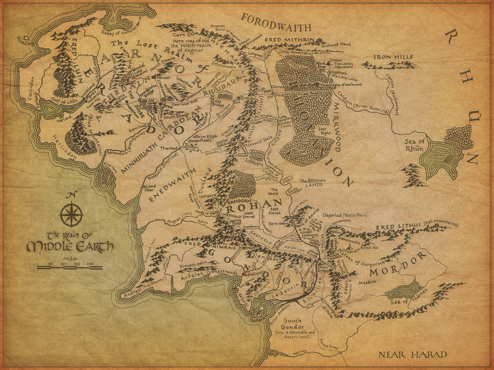

# Documentación del proyecto

## Objetivo

Aplicación web funcional donde los usuarios al autenticarse en el sistema pueden simular batallas con personajes de la época mediaval, ambientado en el Señor de los anillos.

## Estructura del proyecto

- **README.md:** Documentación oficial del proyecto
- **Manage.py:** Archivo que permite ejecutar comandos como iniciar el servidor (runserver), aplicar migraciones (migrate), crear usuarios (createsuperuser), entre otros. Es esencial para la administración y desarrollo de la aplicación Django.
- **tierramedia/:** Directorio donde se almacena los archivos esenciales para la configuración y gestión global del proyecto, incluyendo ajustes, rutas y puntos de entrada para servidores.
- **app/:** Directorio que contiene las funcionalidades esenciales para la creación y el funcionamiento de la aplicación web. Almacena las urls de la aplicación, las vistas, los modelos de datos, etc...

## Tecnologías utilizados

1. Django - Para la creación de la aplicación web
2. Bootstrap5 - Para el diseño de las distintas páginas del proyecto

## Desarrolladores del proyecto
1. Carlos Chacón Atienza - https://github.com/Carlos5Noob
2. Álvaro Fernández de la Calle - https://github.com/Alvarokstar
3. Jonatan García Luna - https://github.com/JonatanGarLun

